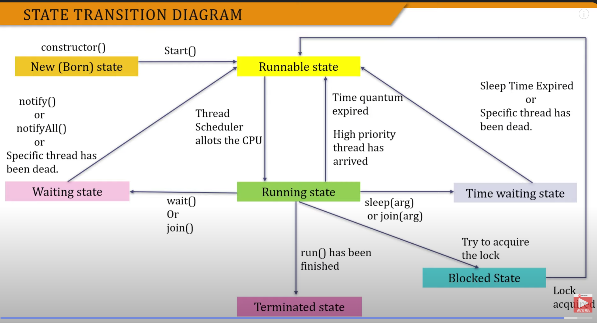

Thread executes and with which the code assosciated to it is executed.
Smallest execution unit.

Multiple threads can be executed simultaneously.
Multithreading can be said "Ek program ke multiple portions ki ek sath chalne ki capability ko Multithreading kehte h"

When start method is triggered, thread get into ThreadPool. ThreadPool is a portion of RAM where all threads lies and executes. OS no schedule the thread and execute with CPU and then run method is executed.So we provide body to the run method by overriding. Check `MyThread class` for the same.
 

**Working of Start() Method**
``` java
class ThreadDemo{
    public static void main(String[] args){
        Thread th  = new Thread();
        th.start();
    }
}

class Thread{
    public void start(){
        //Here lies some code +
        // A thread calling the start function automatically get into Thread Pool.

        run();
    }
    public void run(){
        // Run function is completely empty and need to be manually implemented.
    }
}

```

**Call Stack**

A nice source - https://www.youtube.com/watch?v=BwZtj8HiF9E&list=PL7ersPsTyYt1xUOYJecyFxK4EWwa65tRN&index=5&pp=iAQB

**Sleep**

`public static Thread currentThread() - return object with currently running thread`

To recieve 
```java
Theard th = Thread.currentThread();
String name = th.getName();
```

Sleep method is good but even it can't be sure which thread will be executed as there are multiple threads besides the thread running in our java program.

Whenever a thread is in sleep then the state of the thread is Blocked.
When start is called then Runnable.
When new thread is created then Born.

**Join**
How to use join:

``` java
public static void main(){
Thread thread = new Thread();
thread.start();
try{
thread.join()
} catch(Exception e ){
    e.printStackTrace();
}
}

OR
public static void main() throws InterruptedException{
Thread thread = new Thread();
thread.start();
thread.join()
}
```


When a thread stops its execution till the completion of another thread then join is used.

When `thread.join()` is called then the current thread supposedly main will go into sleep till the thread - refenced on will complete its execution.

**Runnable Interface**

As java doen't support multiple inheritancem, So if we have extended thread class then we can't extend other classes.
So for the solution of this , we use Runnable interface. 

Runnable is a parent of Thread class. 

`Check RunThreadJava class for implementation of Runnable`

**Thread Life Cycle**

1. New (Born) State- Thread constructor has been called
2. Runnable - Start method has been called.
 Running State- Thread scheduler schedule Thread over CPU  + Execution of run() start. // Java mei yeh bhi runnable mei aata h
3. Timed waitin state- Join(arg) or sleep(arg) method has been called.
4. waiting state - waitn() or join() methods has been called.
5. Terminated - execution of run() method has been finished.
6. Blocked - Thread waits to aquire lock. 



**Mutual Exclusive Synchronization**

Synchronized - Critical Section . Can be used on a method
[Link](https://www.youtube.com/watch?v=4I_ZS7vUNzw&list=PL7ersPsTyYt1xUOYJecyFxK4EWwa65tRN&index=10)


